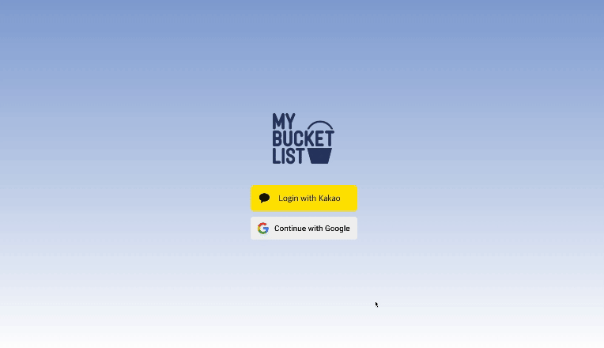
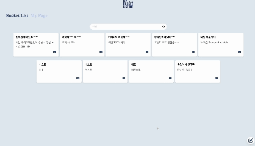
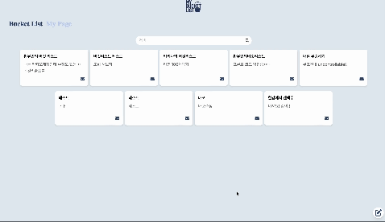
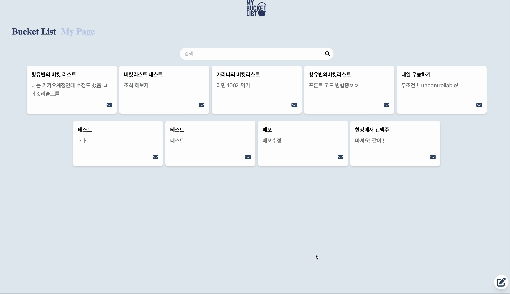

# 💎 Team NewTeams 💎

  🌇 바쁜 현대인들의 힐링과 낭만을 추구하고 누릴 수 있도록하는 서비스 - 낭만 버킷리스트 🌇

    🙋 링크 - https://moyeothon.vercel.app/ 🙋

## 🧑‍💻 멤버
|이름|[박예은](https://github.com/yengniws)|[황유빈](https://github.com/ppinppini)|[이예은](https://github.com/eunxeum)|[송성민](https://github.com/tjdals4716)|[박제영](https://github.com/Zero982)|
|:---:|:---:|:---:|:---:|:---:|:---:|
|프로필||||||
|역할||||||

## 🙋 서비스 소개
- 다양한 사람들과 낭만 가득한 버킷리스트를 공유하고 함께 새로운 경험을 쌓아가는 공간입니다.
- 비 오는 날 포장마차 가기, 한강에서 캔맥 마시기, 번지점프 도전하기 등 자신만의 특별한 버킷리스트를 한 칸씩 업로드할 수 있습니다.
- 같은 목표를 가진 사람들이 쪽지를 보내오면 수락하거나 거절할 수 있으며 수락 시 서로 소통할 수 있는 기회를 제공합니다.
- 원하는 버킷리스트를 클릭하여 자세한 내용을 확인하고 쪽지를 보내 상대방이 수락하면 더 깊은 인연으로 이어드립니다.
- 추가로 AI를 통해 사용자의 취향에 맞춘 버킷리스트를 추천해드리며 다양한 사람들과 문화를 나누고 함께 모임을 만들어가는 특별한 여정을 시작해보세요!

## 🛠️ 사용 기술

### 🌏 Front

	

### 🌐 Back

	

### 💾 Database

    

### 🚀 Deployment

    

### 🗣️ Communication

    

## ✨ 서버 플로우 동작

<table align="center" border="1" cellpadding="10" cellspacing="0" style="border-collapse: collapse; border: 1px solid #ddd;">
  <tr>
    <td align="center" style="border: 1px solid #ddd;">
      <strong>서버 플로우</strong>
    </td>
  </tr>
  <tr>
    <td align="center" style="border: 1px solid #ddd;">
      
    </td>
  </tr>
</table>

## 💻 웹페이지 최종 동작
<table align="center" border="1" cellpadding="10" cellspacing="0" style="border-collapse: collapse; border: 1px solid #ddd;">
  <tr>
    <td align="center" style="border: 1px solid #ddd;">
      <strong>로그인 페이지 / 메인 페이지</strong>
    </td>
  </tr>
  <tr>
    <td align="center" style="border: 1px solid #ddd;">
      
    </td>
  </tr>
</table>

<table align="center" border="1" cellpadding="10" cellspacing="0" style="border-collapse: collapse; border: 1px solid #ddd;">
  <tr>
    <td align="center" style="border: 1px solid #ddd;">
      <strong>버킷리스트</strong>
    </td>
  </tr>
  <tr>
    <td align="center" style="border: 1px solid #ddd;">
      
    </td>
  </tr>
</table>

<table align="center" border="1" cellpadding="10" cellspacing="0" style="border-collapse: collapse; border: 1px solid #ddd;">
  <tr>
    <td align="center" style="border: 1px solid #ddd;">
      <strong>쪽지 보내기 / 버킷리스트 검색</strong>
    </td>
  </tr>
  <tr>
    <td align="center" style="border: 1px solid #ddd;">
      
    </td>
  </tr>
</table>

<table align="center" border="1" cellpadding="10" cellspacing="0" style="border-collapse: collapse; border: 1px solid #ddd;">
  <tr>
    <td align="center" style="border: 1px solid #ddd;">
      <strong>AI 추천</strong>
    </td>
  </tr>
  <tr>
    <td align="center" style="border: 1px solid #ddd;">
      
    </td>
  </tr>
</table>
